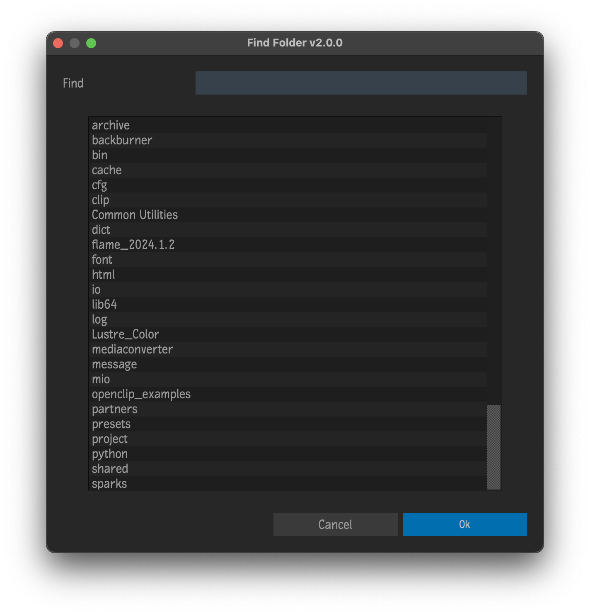

# Find Folder

Plugin for [Autodesk Flame](http://www.autodesk.com/products/flame)

Filter subdirectories of the current directory in Media Hub Files.  Useful when a directory contains a *LARGE* number of subdirectories.

## Compatibility
|Release Version|Flame Version|
|---|---|
|v3.X.X|Flame 2025 and up|
|v2.X.X|Flame 2022 up to 2024.2|
|v1.X.X|Flame 2021 up to 2021.2|

## Installation
To make available to all users on the workstation, copy `find-folder.py` to `/opt/Autodesk/shared/python`

For specific users, on Linux copy to `~/flame/python` or on Mac, copy to `~/Library/Preferences/Autodesk/flame/python` 

## Menus
 - Right-click selected folder in Media Hub Files -> `Find...` -> `Find Folder`

## Acknowledgments
UI Templates courtesy of [pyflame.com](http://www.pyflame.com)
